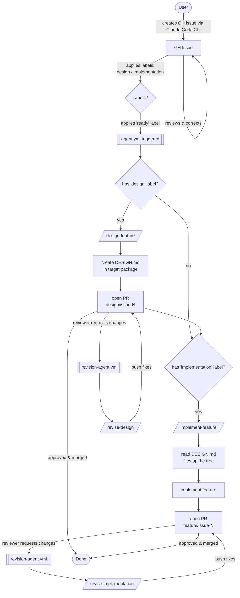

# Dance CRM — Project Context for Claude

## Repository
- GitHub: https://github.com/artva/dance-crm

## Dev Lifecycle (AI-Assisted)

This project uses a fully AI-driven development workflow via GitHub Actions and Claude agents.

### Issue Lifecycle

1. **Issue creation** — User asks Claude Code (CLI) to create a GH issue.
2. **Review** — User reviews and corrects the issue.
3. **Tag the issue** — User applies `design` and/or `implementation` labels.
4. **Trigger** — User applies `ready` label to kick off the agent.
5. **Design** *(if `design` label present)* — Agent runs `/design-feature`: determines the target package, reads parent `DESIGN.md` files for context, creates `<package>/DESIGN.md`, opens a PR on branch `design/issue-<N>`.
6. **Implementation** *(if `implementation` label present)* — Agent runs `/implement-feature`: reads `DESIGN.md` files up the package tree, implements the feature, opens a PR on branch `feature/issue-<N>`.
7. **Revision loop** — If reviewer requests changes, agent runs `/revise-design` or `/revise-implementation` and pushes fixes to the existing branch.

### Issue Labels

| Label | Meaning |
|-------|---------|
| `design` | Issue requires a design document |
| `implementation` | Issue requires code implementation |
| `ready` | Trigger — kicks off the agent |

### Design Docs

- Design docs live **inside the package they belong to**: `<package>/DESIGN.md`
- When designing or implementing, the agent reads all `DESIGN.md` files from the target package up to the repo root for context
- Missing `DESIGN.md` at any level is fine — skipped silently

### Branch Naming

| Branch | Purpose |
|--------|---------|
| `design/issue-<N>` | Design doc PR |
| `feature/issue-<N>` | Implementation PR |

### GitHub Actions Workflows

| Workflow | Trigger | Action |
|----------|---------|--------|
| `agent.yml` | Label `ready` added | Checks tags, runs `/design-feature` and/or `/implement-feature` |
| `revision-agent.yml` | PR review "changes requested" | Checks branch prefix, runs `/revise-design` or `/revise-implementation` |

### Skills (`.claude/commands/`)

| Skill | Purpose |
|-------|---------|
| `/design-feature` | Create `DESIGN.md` in target package, open design PR |
| `/implement-feature` | Implement feature using design docs, open code PR |
| `/revise-design` | Address review comments on a design PR |
| `/revise-implementation` | Address review comments on an implementation PR |

### AI Agent
- Uses `anthropic/claude-code-action@v1`
- Requires secret: `ANTHROPIC_API_KEY`
- Env vars: `ISSUE_NUMBER` (agent workflows), `PR_NUMBER` (revision workflows)

## Pending Setup

- [ ] Tech stack to be decided
- [ ] Anthropic API key to be added as GH Actions secret